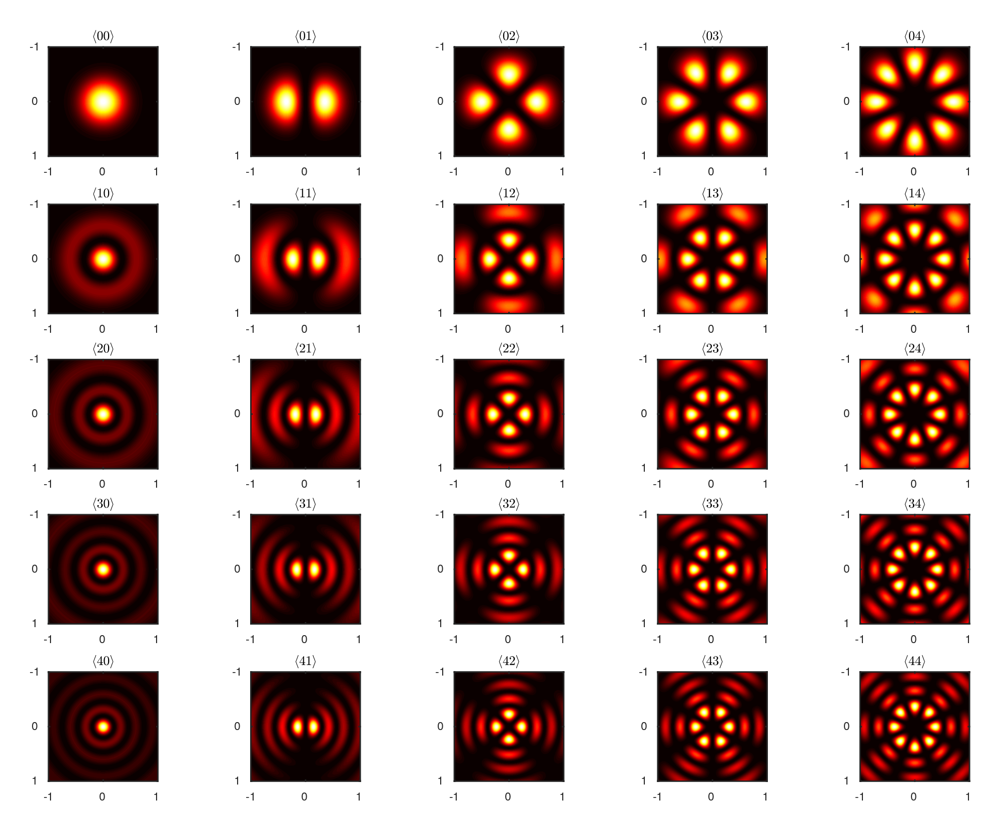

# PolyPack

Hermite, Laguerre, Legendre polynomials, Laplace spherical harmonics (real and complex basis), Mollweide projection (CMB radiation style) generated in symbolic form and others++. Requires MATLAB symbolic toolbox.

mikael.mieskolainen@cern.ch, 2018
